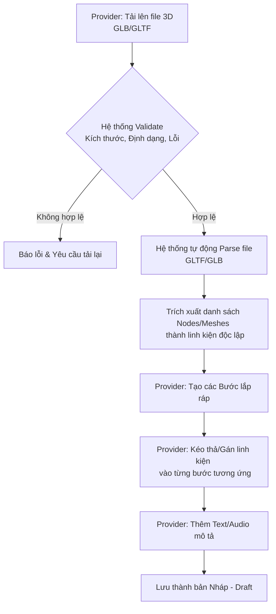

# DACMPN-24

```mermaid
graph TD
    A[Provider: Tải lên file 3D <br> GLB/GLTF] --> B{Hệ thống Validate <br> Kích thước, Định dạng, Lỗi}
    
    B -- Không hợp lệ --> C[Báo lỗi & Yêu cầu tải lại]
    
    B -- Hợp lệ --> D[Hệ thống tự động Parse file <br> GLTF/GLB]
    D --> E[Trích xuất danh sách Nodes/Meshes <br> thành linh kiện độc lập]
    
    E --> F[Provider: Tạo các Bước lắp ráp]
    F --> G[Provider: Kéo thả/Gán linh kiện <br> vào từng bước tương ứng]
    G --> H[Provider: Thêm Text/Audio mô tả]
    
    H --> I[Lưu thành bản Nháp - Draft]
```
