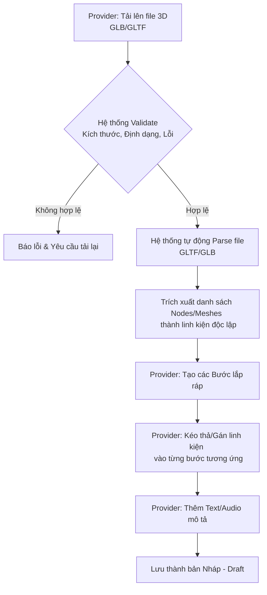
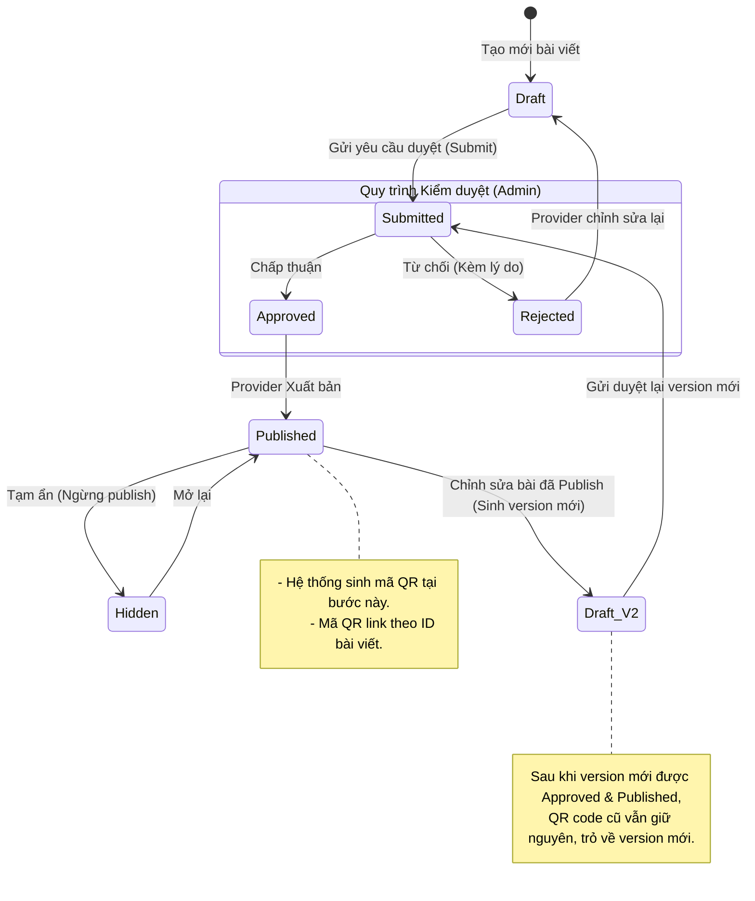
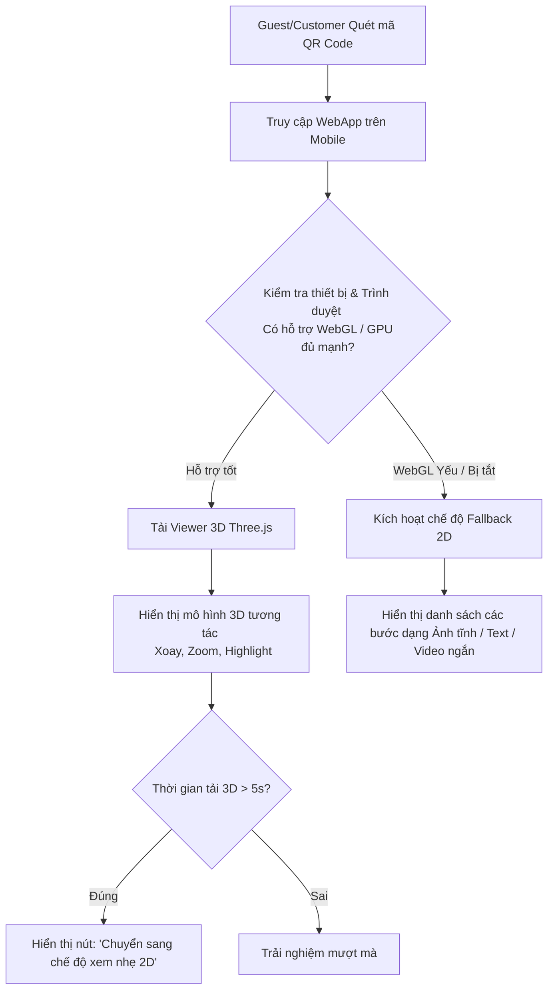
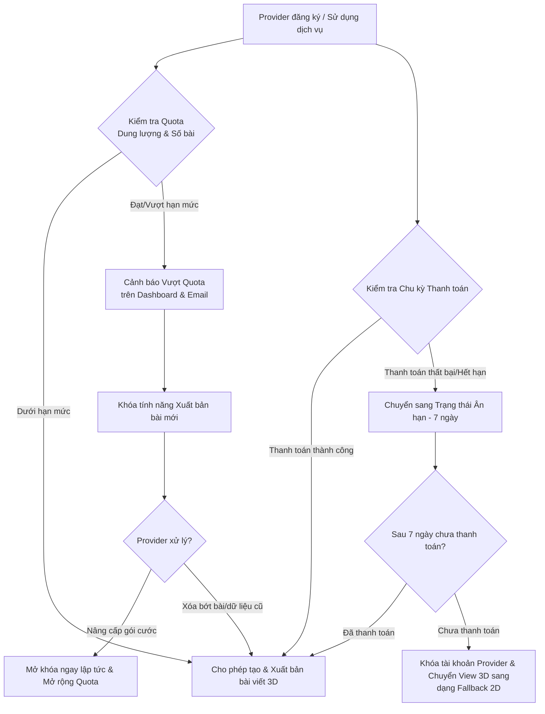

# DACMPN-24

## Tài liệu dự án
- [Xem Requirement Outline (RO)](https://drive.google.com/drive/u/0/folders/1JpALwpWWb9QYQpeqq1AwARhUL7bqrZ2U)
- [Xem Sơ đồ Quy trình & Trạng thái (Mermaid)](./docs/diagrams.md)

## Sơ đồ quy trình Upload và Bóc tách File 3D

## Sơ đồ Vòng đời Trạng thái Bài Hướng Dẫn

## Sơ đồ Xử lý Fallback trải nghiệm Guest trên Mobile

## Sơ đồ Xử lý Quota & Tài khoản SaaS

